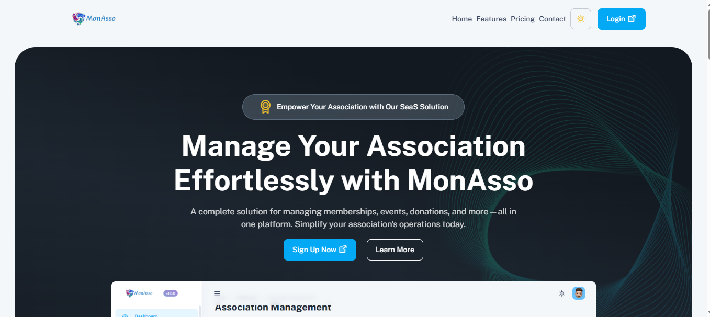
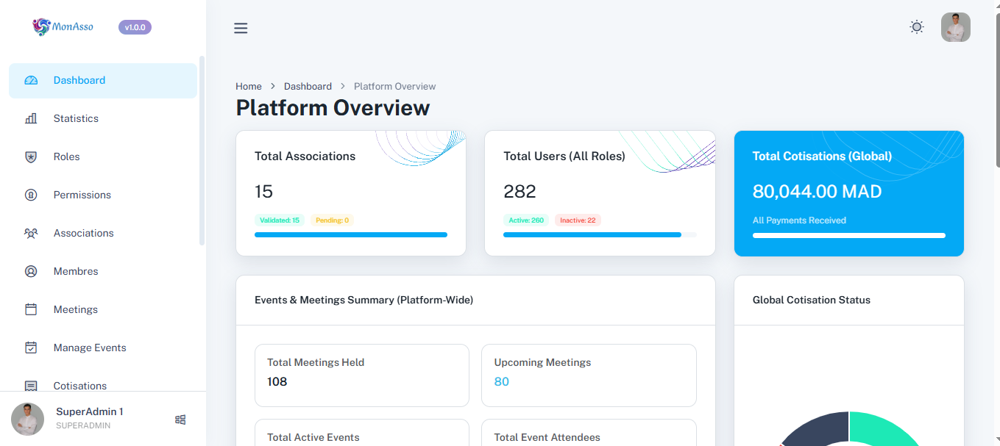
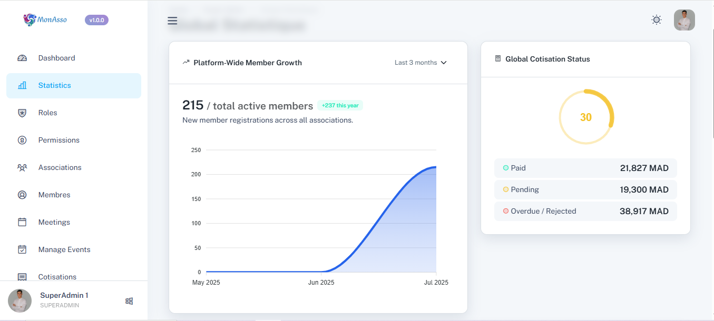
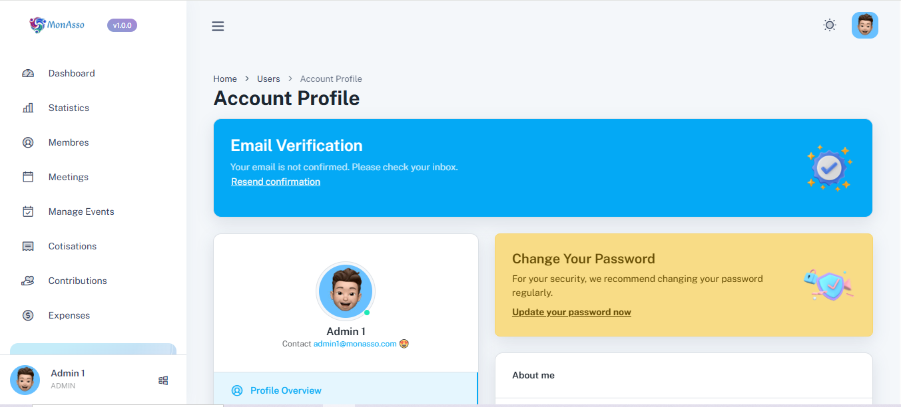

# 🎯 MonAsso – SaaS Platform for Association Management

**MonAsso** is a modern and responsive SaaS web platform built to simplify the management of non-profit associations. It empowers associations to manage their members, meetings, contributions, events, documents, expenses, and statistics — all in one place.

Built with **Laravel**, the system features modular design, dynamic dashboards, role-based access control, and a user-friendly admin panel.

---

## 🖼️ Screenshots

| Capture | Description |
|--------|-------------|
|    | 🏠 Landing Page |
|   | 🖥️ Dashboard with stats and charts |
|   | 📊 Statistics module with filters |
|   | 👥 Edit Profile |

## 🚀 Key Features

### 🔐 Role-Based Access Control
Each user role has tailored access:
- **Super Admin** – Full system access across all associations
- **Admin** – Manages their own association (CRUD access)
- **Board Member** – Supervises without delete permissions
- **Supervisor** – Can create members, meetings, events, documents
- **Member** – Views their own profile, meetings, and payments

---

## 🧩 Modules Overview

| Module         | Description                                                |
|----------------|------------------------------------------------------------|
| 👥 Members      | Add/edit members, upload photos, assign roles              |
| 💰 Contributions | Record membership fees per year per user                  |
| 📅 Meetings     | Schedule meetings with files and statuses                  |
| 📁 Documents     | Manage attachments using Spatie MediaLibrary              |
| 🎉 Events        | Create and manage association events                      |
| 📊 Statistics    | View performance insights with dynamic ApexCharts         |
| 💸 Expenses      | Track association expenses and budgets                    |
| 🔐 Permissions   | Fine-grained access control using Spatie Permission       |

---

## ⚙️ Tech Stack

- **Framework**: Laravel 10+
- **Frontend**: Blade, Bootstrap 5, Animate.css
- **Charts**: ApexCharts.js
- **File Uploads**: Spatie MediaLibrary
- **Authentication**: Laravel Auth + Email Verification
- **Roles/Permissions**: Spatie Laravel-Permission
- **Database**: MySQL
- **Deployment**: Optimized for Shared Hosting & VPS

---

## 💻 Local Installation

```bash
# 1. Clone the project
git clone https://github.com/Rochdi7/MonAsso.git
cd monasso

# 2. Install dependencies
composer install

# 3. Copy environment config and generate app key
cp .env.example .env
php artisan key:generate

# 4. Configure your .env (DB credentials, mail, etc.)

# 5. Migrate and seed database
php artisan migrate --seed

# 6. Link storage (for profile photos/documents)
php artisan storage:link

# 7. Install frontend assets
npm install && npm run build

# 8. Start the local server
php artisan serve
```

---

## 🧪 Default Admin Accounts

| Role         | Email                | Password  |
|--------------|----------------------|-----------|
| Super Admin  | super@monasso.com    | password  |
| Admin        | admin@monasso.com    | password  |

> You can customize these in the seeders or directly in the database.

---

## 📈 Dashboard Features

Each role sees a personalized dashboard:
- **Admins**: Members, donations, meetings, cotisations, top contributors
- **Super Admin**: All associations' global stats
- **Board Members**: Read-only KPIs & decision summaries
- **Members**: Their own data, meeting participation, payment history

---

## 🤝 Credits

Project by:  
**Rochdi Karouali** & **Halima Dakir**  
🎓 Final Year Project – École Racine Marrakech  
🧑‍🏫 Supervised by Mr. Abdelhamid Boukhrisse

---

## 📄 License

This project is licensed under the [MIT License](LICENSE).

---

## 🌍 Live Demo

> Coming soon at [monasso.yourdomain.com](https://monasso.yourdomain.com)

---

## 👏 Contributions

Pull requests, feature suggestions, and feedback are welcome!
